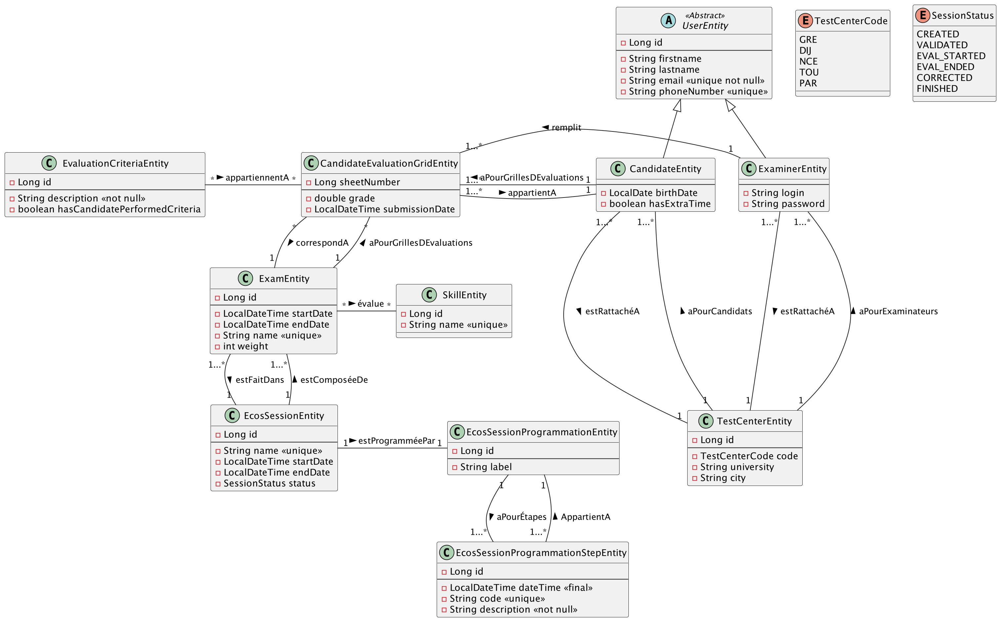

# <u>L3 Miage - BDD -TP4 - <b style="color:red">noté</b></u>

* Pour pouvoir démarrer tous les TPs simplement, assurez-vous d'avoir tous les prérequis :
    * voir les [prérequis](prerequis.md)

# Situation 

Les ECOS (Examens Cliniques Objectifs et Structurés) sont des examens pratiques que passent les étudiants à l’issue de leur 6ème année de médecine, à la suite de l’examen théorique EDN (Épreuves Dématérialisées Nationales). Ces examens conditionnent leur accès au troisième cycle des études médicales et leurs choix d’internat et de spécialité.

Vous faites partie de l’équipe de développement qui va développer une application web permettant le déroulement d’une session d’examen ECOS. Votre architecte vous a fourni un diagramme UML que vous allez devoir implémenter.

Une session doit être programmée pour qu’elle puisse se dérouler correctement dans le temps. On lui rattache ainsi une programmation de session, qui est composée d'un label, et qui comporte plusieurs étapes de programmation. Chaque étape dispose d’un code unique, d'une date de réalisation et d’une description textuelle obligatoire. Une programmation de session appartient à une seule session, et une étape de programmation appartient à une seule programmation.

L’application accueille 2 types d’utilisateurs :
-	les candidats, qui possèdent une date de naissance, et qui peuvent ou non disposer d’un tiers temps. Les candidats n’utilisent pas directement l’application
-	les examinateurs, qui disposent d’un login de 6 caractères et d’un mot de passe pour se connecter à l’application et remplir la grille d’évaluation d’un candidat pour un examen donné

Tous les utilisateurs possèdent un nom, un prénom, un email unique et obligatoire, et un numéro de téléphone à 8 chiffres unique.

Chaque utilisateur est rattaché à un centre d’examen, composé d’un code, d’un nom d’université de rattachement et d’un nom de ville. Un centre d’examen accueille plusieurs candidats et examinateurs.

Pendant un examen, un examinateur se connecte à l’application, sélectionne le candidat qu’il doit évaluer, et remplit une grille d’évaluation. Chaque grille d’évaluation est composée d’une note, qui doit avoir 2 chiffres après la virgule, et d’une liste de critères d’évaluation. Un critère d’évaluation représente une tâche, une observation ou une demande que doit réaliser le candidat pendant l’examen pratique, et est représenté par une description textuelle, et une note d’observation (qui permet de savoir si oui ou non le candidat a réalisé correctement ce critère).

Une grille d’évaluation appartient à un unique candidat et est remplie par un unique examinateur.

# Exo :

1. Implémentez le modèle en JPA
    * Vous devez avoir le moins de tables possible !
    * La méthode pour l'héritage doit être `TABLE_PER_CLASS`

2. Implémentez tous les repository des entités.

3. Implémentez ces 5 requêtes :
  * Récupérer la dernière étape de la programmation qui devra être réalisée (<b style="color:green">fonction nommée</b>)
  * Récupérer la liste des candidats du TestCenter ayant le code 'GRE' (<b style="color:green">fonction nommée</b>)
  * Récupérer les candidats qui ont eu au moins 1 note éliminatoire (<=5) (<b style="color:green">fonction nommée + CandidateComponent</b>)
  * Récupérer les candidats qui n'ont pas de temps additionnel et qui sont nés avant le 01/01/2000(<b style="color:green">fonction nommée</b>)
  * Récupérer la liste des examens qui évaluent au moins une compétence en lien avec 'cardio' contenu dans le nom.(<b style="color:green">fonction + ExamComponent</b>)

<b style="color:green">note : </b> Pour les requêtes, vous devez utiliser les **fonctions nommées** au maximum, et utiliser un **component** si cela ne suffit pas. Vous ne devez pas utiliser du <b style="color:red">JPQL</b> ou encore du <b style="color:red">SQL</b>

---

# 
Fin de tp
